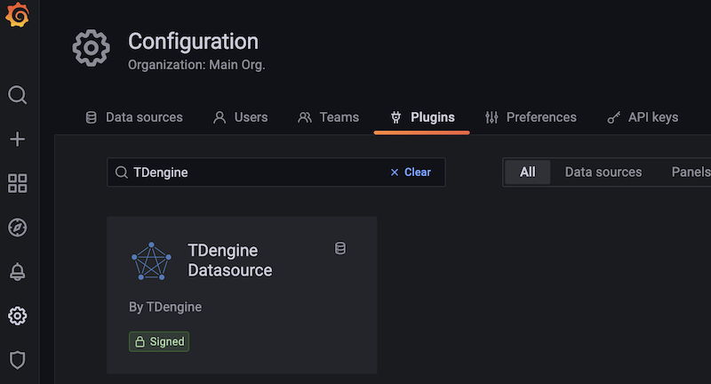
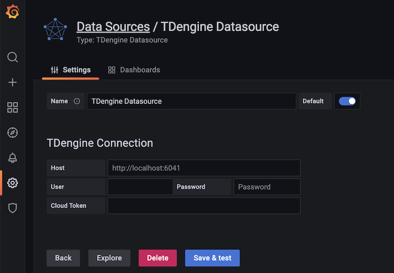

# TDinsight - A Monitoring Solution For [TDengine] with [Grafana]

Languages: _English_ _[简体中文](https://www.taosdata.com/cn/documentation/tools/insight)_

TDinsight v3.x is a solution for monitoring TDengine using the builtin native monitoring database and Grafana.

TDengine writes monitoring data into a special database through [taosKeeper](https://github.com/taosdata/taoskeeper).
The metrics may include the server's CPU, memory, hard disk space, network bandwidth, number of requests, disk
read/write speed, slow queries, other information like important system operations (user login, database creation,
database deletion, etc.), and error alarms. With [Grafana](https://grafana.com/)
and [TDengine Data Source Plugin](https://github.com/taosdata/grafanaplugin/releases), TDinsight can visualize cluster
status, node information, insertion and query requests, resource usage, vnode, dnode, and mnode status, exception alerts
and many other metrics. This is very convenient for developers who want to monitor TDengine cluster status in real-time.

This article will guide users to install the Grafana server and TDengine Data Source Plugin, and deploy the TDinsight
v3.x.

## Requirements

- a single-node TDengine server or a multi-node TDengine cluster and a Grafana server are required. This dashboard
  requires TDengine 3.0.1.0 and above, with the monitoring feature enabled. For detailed configuration, please refer to
  [TDengine monitoring configuration](https://docs.tdengine.com/reference/config/#monitoring-parameters).
- taosAdapter has been instaleld and running, please refer
  to [taosAdapter](https://docs.tdengine.com/reference/taosadapter/).
- taosKeeper has been installed and running, please refer
  to [taosKeeper](https://docs.tdengine.com/reference/taosKeeper/).

## Install Grafana

We recommend using the latest [Grafana](https://grafana.com/) version 8 or 9. You can install Grafana on any
supported operating system by following
the [official Grafana documentation Instructions](https://grafana.com/docs/grafana/latest/installation/) to install
Grafana.

### Installing Grafana on Debian or Ubuntu

For Debian or Ubuntu operating systems, we recommend the Grafana image repository and using the following command to
install from scratch.

```bash
sudo apt-get install -y apt-transport-https
sudo apt-get install -y software-properties-common wget
wget -q -O - https://packages.grafana.com/gpg.key |\
  sudo apt-key add -
echo "deb https://packages.grafana.com/oss/deb stable main" |\
  sudo tee -a /etc/apt/sources.list.d/grafana.list
sudo apt-get update
sudo apt-get install grafana
```

### Install Grafana on CentOS / RHEL

You can install it from its official YUM repository.

```bash
sudo tee /etc/yum.repos.d/grafana.repo << EOF
[grafana]
name=grafana
baseurl=https://packages.grafana.com/oss/rpm
repo_gpgcheck=1
enabled=1
gpgcheck=1
gpgkey=https://packages.grafana.com/gpg.key
sslverify=1
sslcacert=/etc/pki/tls/certs/ca-bundle.crt
EOF
sudo yum install grafana
```

Or install it with RPM package.

```bash
wget https://dl.grafana.com/oss/release/grafana-7.5.11-1.x86_64.rpm
sudo yum install grafana-7.5.11-1.x86_64.rpm
# or
sudo yum install \
  https://dl.grafana.com/oss/release/grafana-7.5.11-1.x86_64.rpm
```

## set up TDinsight v3.x

### Install the TDengine data source plugin

#### Install the latest version of the TDengine Data Source plugin from GitHub

```bash
get_latest_release() {
  curl --silent "https://api.github.com/repos/taosdata/grafanaplugin/releases/latest" |
    grep '"tag_name":' |
    sed -E 's/.*"v([^"]+)".*/\1/'
}
TDENGINE_PLUGIN_VERSION=$(get_latest_release)
sudo grafana-cli \
  --pluginUrl https://github.com/taosdata/grafanaplugin/releases/download/v$TDENGINE_PLUGIN_VERSION/tdengine-datasource-$TDENGINE_PLUGIN_VERSION.zip \
  plugins install tdengine-datasource
```

**NOTE**: The 3.1.6 and earlier version plugins require the following setting in the configuration
file `/etc/grafana/grafana.ini` to enable unsigned plugins.

```ini
[plugins]
allow_loading_unsigned_plugins = tdengine-datasource
```

#### Install TDengine Data Source plugin from Grafana Plugins page

Point to the **Configurations** -> **Plugins**(or "/plugins" url), and search "TDengine".



Click "TDengine Datasource", and click "install".


### Start the Grafana service

```bash
sudo systemctl start grafana-server
sudo systemctl enable grafana-server
```

### Logging into Grafana

Open the default Grafana URL in a web browser: `http://localhost:3000`. The default username/password is `admin`.
Grafana will require a password change after the first login.

### Adding a TDengine Data Source

Point to the **Configurations** -> **Data Sources** menu, and click the **Add data source** button.


Search for and select **TDengine**.


Configure the TDengine datasource.



Save and test. It will report 'TDengine Data source is working' in normal circumstances.


### Importing dashboard

#### Importing dashboard from datasource confining page.

Click **Dashboard** tab in TDengine datasource confining page.


Click the "import" button of "TDinsight for 3.x", and import the dashboard.

### Import dashboard from importing page

Point to **+** / **Create** - **import** (or `/dashboard/import` url).


Input dashboard id `18180` in **Import via grafana.com** and click **Load**.


After importing, TDinsight v3.x dashboard as follows.


## TDinsight v3.x Dashboard details

The TDinsight dashboard is designed to provide the usage and status of TDengine-related resources,
e.g. [dnodes, mnodes, vnodes](https://www.taosdata.com/cn/documentation/architecture#cluster) and databases.

The details of the metrics are as follows.

### Cluster Status


This section contains the current information and status of the cluster (from left to right, top to bottom).

- **First EP**: the firstEp setting in the current TDengine cluster.
- **Version**: TDengine server version (leader mnode).
- **Master Uptime**: The time elapsed since the current Leader MNode was elected as Leader.
- **Expire Time**: Enterprise version expiration time.
- **Used Measuring Points**: The number of measuring points used by the Enterprise Edition.
- **Databases**: The number of databases.
- **Tables**: The number of table.
- **Connections**: The number of current connections.
- **DNodes/MNodes/VGroups/VNodes**: Total number of each resource and the number of survivors.
- **DNodes/MNodes/VGroups/VNodes Alive Percent**: The ratio of the number of alive/total for each resource.
- **Measuring Points Used**: The number of measuring points(no data available in the community version, healthy by
  default).
- **Grants Expire Time**: the expiration time of the enterprise version (no data available for the community version,
  healthy by default).
- **Error Rate**: Aggregate error rate (average number of errors per second) for alert-enabled clusters.

### DNodes Status


- **DNodes Status**: simple table view of `show dnodes`.
- **DNodes Lifetime**: the time elapsed since the dnode was created.
- **DNodes Number**: the trends in the number of DNodes.

### MNode Overview


1. **MNodes Status**: a simple table view of `show mnodes`.
2. **MNodes Number**: similar to `DNodes Number`, the trends in the number of MNodes.

### Request


1. **Requests Rate(Inserts per Second)**: average number of inserts per second.
2. **Requests (Selects)**: number of query requests and rate of change (count of second).

### Database


Database usage, repeated for each value of the variable `$database`, one rows per database.

1. **STables**: number of super tables.
2. **Total Tables**: number of all tables.
3. **Tables**: number of normal tables.
4. **Tables Number Foreach VGroups**: number of tables per vgroup.

### DNode Resource Usage


数据节点资源使用情况展示, 对变量 `$fqdn` 即每个数据节点进行重复多行展示.包括:

Data node resource usage display with repeated multiple rows for the variable `$fqdn`, one rows per dnode.

1. **Uptime**: the time elapsed since the dnode was created.
2. **Has MNodes?**: whether the current dnode is a mnode.
3. **CPU Cores**: the number of CPU cores.
4. **VNodes Number**: the number of VNodes in the current dnode.
5. **VNodes Masters**: the number of vnodes in the leader role.
6. **Current CPU Usage of taosd**: CPU usage rate of taosd processes.
7. **Current Memory Usage of taosd**: memory usage of taosd processes.
8. **Disk Used**: The total disk usage percentage of the taosd data directory.
9. **CPU Usage**: Process and system CPU usage.
10. **RAM Usage**: Time series view of RAM usage metrics.
11. **Disk Used**: Disks used at each level of multi-level storage (default is level0).
12. **Disk IO**: Disk IO rate.
13. **Net IO**: Network IO, the aggregate network IO rate in addition to the local network.

### Login History


Currently, only the number of logins per minute is reported.

### taosAdapter


Support monitoring taosAdapter request statistics and status details.

1. **http_request**: number of total requests.
2. **Http Request Fail**: number of failed requests.
3. **CPU Used**: usage of taosAdapter.
4. **Memory Used**: Memory usage of taosAdapter.
5. **Http Request Inflight**: number of real-time requests of each endpoint.
6. **Http Status Code**: taosAdapter http status code.

## Upgrade

You can update TDengine Grafana datasource plugin and TDinsight for 3.x by re-installation.

## Uninstall

To completely uninstall TDinsight during a manual installation, you need to clean up the following.

1. the TDinsight v3.x Dashboard in Grafana.
2. the Data Source in Grafana.
3. the `tdengine-datasource` plugin in Grafana.

## Integrated Docker Example

```bash
git clone --depth 1 https://github.com/taosdata/grafanaplugin.git
cd grafanaplugin
```

Change as needed in the `docker-compose.yml` file:

```yaml
version: "3.7"

services:
  tdengine:
    image: tdengine/tdengine:3.0.2.5
    environment:
      TAOS_FQDN: localhost
  grafana:
    image: grafana/grafana:9.5.20
    volumes:
      - ./dist:/var/lib/grafana/plugins/tdengine-datasource
      - ./grafana/grafana.ini:/etc/grafana/grafana.ini
      - ./grafana/provisioning/:/etc/grafana/provisioning/
      - grafana-data:/var/lib/grafana
    environment:
      TDENGINE_API: ${TDENGINE_API}
      TDENGINE_USER: ${TDENGINE_USER}
      TDENGINE_PASS: ${TDENGINE_PASS}
      SMS_ACCESS_KEY_ID: ${SMS_ACCESS_KEY_ID}
      SMS_ACCESS_KEY_SECRET: ${SMS_ACCESS_KEY_SECRET}
      SMS_SIGN_NAME: ${SMS_SIGN_NAME}
      SMS_TEMPLATE_CODE: ${SMS_TEMPLATE_CODE}
      SMS_TEMPLATE_PARAM: "${SMS_TEMPLATE_PARAM}"
      SMS_PHONE_NUMBERS: $SMS_PHONE_NUMBERS
      SMS_LISTEN_ADDR: ${SMS_LISTEN_ADDR}
    ports:
      - 3000:3000
volumes:
  grafana-data:
```

Replace the environment variables in `docker-compose.yml` or save the environment variables to the `.env` file, then
start Grafana with `docker-compose up`. For more information of  `docker-compose`, please refer
to [Docker Compose Reference](https://docs.docker.com/compose/)

```bash
docker-compose up -d
```

Then the TDinsight was deployed via Provisioning. Go to http://localhost:3000/d/tdinsight/ to view the dashboard.

[Grafana]: https://grafana.com

[TDengine]: https://www.taosdata.com
